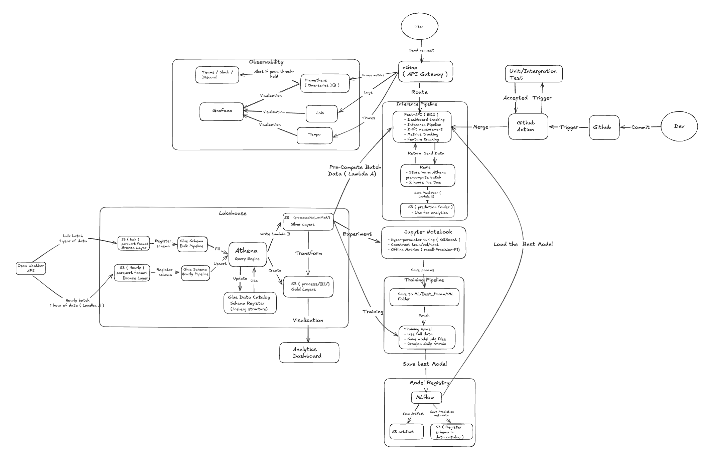

# AQI-MLops

End-to-end MLOps pipeline for real-time Air Quality Index prediction across 99 global cities.

Live dashboard: http://3.94.115.44

---
## Overview Architecture 


## What This Project Does

This system fetches live air quality data every hour for 99 cities around the world, stores it in a data lakehouse on AWS S3 using Apache Iceberg, runs an XGBoost machine learning model to predict the next hour's AQI class for each city, and serves those predictions through a web dashboard with sub-millisecond response times. It also monitors model drift, tracks prediction accuracy over time in a dedicated predictions table, retrains the model automatically every day, and pushes all observability signals (metrics, traces, logs) directly to Grafana Cloud.

---

## System Architecture

The system has three Lambda functions, a FastAPI service on EC2, a Redis caching layer, and a direct push observability pipeline to Grafana Cloud. Here is how data flows through the system.

**Step 1 — Data Ingestion (Lambda A)**

Lambda A runs every hour via an EventBridge schedule. It fetches live air quality readings for all 99 cities from the OpenWeatherMap API and writes the raw data as a Parquet file to S3 at s3://weather-bulk/hourly/. After writing, it invokes Lambda B asynchronously.

**Step 2 — Data Merging (Lambda B)**

Lambda B receives the trigger and runs a MERGE INTO query in Athena to insert the new 99 rows into the Silver Iceberg table aqi_db.aqi_unified while deduplicating by city and timestamp. After the merge succeeds, Lambda B sends a POST /warm-cache HTTP request to the FastAPI service on EC2.

**Step 3 — Batch Inference and Caching (FastAPI on EC2)**

When /warm-cache is called, FastAPI queries Athena for the last 340 hours of sensor data for all 99 cities in a single query. It uses those rows to build 19-feature vectors and runs the XGBoost model to predict each city's next-hour AQI class. All predictions are saved to Redis with a 2-hour TTL. Per-city drift payloads and global metrics are also computed and cached. Each prediction is also appended to a Redis list called aqi:pred_buffer so Lambda C can persist them to storage.

In addition to being triggered by Lambda B, FastAPI runs a self-warming background thread (default every 3600 s, configurable via WARM_INTERVAL_SEC) that calls warm_cache() independently, so the cache stays hot even if Lambda B is unavailable.

When a user opens the dashboard and requests a prediction, FastAPI reads the cached result from Redis directly. No Athena query happens at serving time.

**Step 4 — Prediction Persistence (Lambda C)**

Lambda C runs every hour at 5 minutes past the hour via EventBridge. It reads all records from aqi:pred_buffer in Redis, writes them as a single Parquet file to s3://weather-bulk/predictions/, then runs an INSERT INTO on the Athena predictions Iceberg table to register the records permanently. This builds a historical record of every prediction the model has ever made.

**Step 5 — Model Retraining (GitHub Actions daily)**

Every day at 05:00 UTC, a GitHub Actions workflow (daily_retrain.yml) runs the CI gate (lint + unit tests), retrains the XGBoost model on the latest Athena data, smoke-tests the new model, uploads the new artifacts to EC2 via SCP, and calls POST /reload-model to hot-swap the model in memory without any downtime.

**Data Flow Summary**

```
Lambda A (every hour at :00)
  reads 99 cities from OpenWeatherMap API
  writes Parquet to s3://weather-bulk/hourly/
  invokes Lambda B

Lambda B (triggered by Lambda A)
  MERGE INTO aqi_db.aqi_unified  (Silver Iceberg, deduplication)
  POST /warm-cache to FastAPI on EC2

FastAPI /warm-cache
  queries Athena: SELECT last 340 hours for all 99 cities
  builds 19-feature vectors from sensor rows
  runs XGBoost model on each city
  saves to Redis: aqi:predict:{slug}          (2hr TTL, for dashboard)
  saves to Redis: aqi:history:{slug}:{h}      (2hr TTL, windows: 24/48/72/168h)
  saves to Redis: aqi:drift:{slug}:{window}   (2hr TTL, windows: 1d/7d)
  saves to Redis: aqi:model-metrics:global:{h}(2hr TTL, global metrics)
  appends to Redis: aqi:pred_buffer           (for Lambda C)

Lambda C (every hour at :05)
  reads all records from aqi:pred_buffer in Redis
  writes one Parquet file to s3://weather-bulk/predictions/
  INSERT INTO aqi_db.predictions         (Gold Iceberg)

Dashboard request for a city prediction
  FastAPI reads from Redis               (under 1 millisecond)

Every day 05:00 UTC
  GitHub Actions retrains XGBoost on Athena data
  uploads new artifacts to EC2
  hot-reloads model via POST /reload-model
```

---

## Repository Structure

```
app/
  main.py                     All HTTP routes, Redis caching logic, warm-cache endpoint
  inference.py                Feature engineering, predict_single, batch_predict, load_artifacts
  telemetry.py                Observability: traces, metrics, and logs push to Grafana Cloud
  templates/
    index.html                Dashboard (Alpine.js + Chart.js, no build step)

data-pipeline/
  lambda/
    handler.py                Lambda A: fetch 99 cities from OpenWeatherMap, upload to S3
  fetch_weather.py            Historical backfill script (run once)
  config.yaml                 City list, S3 bucket, API URL

lakehouse/
  merge_handler.py            Lambda B: MERGE INTO aqi_unified, then call /warm-cache
  prediction_flush_handler.py Lambda C: flush Redis pred_buffer to S3 and Athena
  setup.sql                   Athena DDL for all four tables
  backfill.py                 One-time historical data load into aqi_unified
  deploy_lakehouse.sh         Deploys Lambda B, Lambda C, IAM roles, Athena tables

ml/
  train.py                    XGBoost training pipeline (Athena to model artifacts)
  best-config.yaml            Locked hyperparameters from search experiments
  model-registry/             model.ubj, median.json, features.json (not tracked in git)

tests/
  conftest.py                 Auto-creates minimal model artifacts for CI
  test_inference.py           16 tests for feature engineering and predictions
  test_training_logic.py      14 tests for data preparation (no AWS)
  test_api.py                 22 tests for all API endpoints (Athena mocked)

deploy/
  setup_ec2.sh                One-time EC2 bootstrap (Docker, nginx, systemd)
  aqi-api.service             systemd unit managing docker compose lifecycle
  nginx.conf                  Reverse proxy from port 80 to port 8000

Dockerfile                    Multi-stage build (python:3.12-slim + uv, non-root user)
docker-compose.yml            Production compose with model-registry volume bind-mount
.github/workflows/            CI, CD, and daily retrain workflows
```

---

## API Endpoints

| Method | Path | Description |
|--------|------|-------------|
| GET | / | Interactive dashboard |
| GET | /cities | All 99 cities with coordinates and timezone |
| GET | /predict/{city_slug} | Next-hour AQI prediction (served from Redis) |
| GET | /history/{city_slug} | Predicted vs actual AQI chart data (24, 48, 72, or 168 hours) |
| GET | /drift/{city_slug} | Per-city feature drift z-scores: today vs yesterday (1d) or this week vs prior week (7d) |
| GET | /drift | Global drift across all 99 cities pooled (model-level input distribution shift) |
| GET | /model-metrics | Global weighted F1, Precision, Recall pooled across all 99 cities |
| GET | /accuracy-trend | Global day-by-day accuracy trend for concept drift detection |
| GET | /feature-importance | XGBoost feature importances (weight, gain, cover) |
| GET | /feature-importance/history | Feature importance trend across the last 30 daily retrains |
| GET | /health | Service health and model metadata |
| GET | /cache/status | Redis connection status, key count, and memory used |
| POST | /warm-cache | Pre-compute predictions for all 99 cities in one batch |
| POST | /reload-model | Hot-swap model artifacts without restarting the container |

---

## Data Lakehouse Layers

| Layer | S3 Location | What it contains |
|-------|-------------|------------------|
| Bronze | s3://weather-bulk/data-pipeline/ | Raw historical Parquet files from bulk ingest, unchanged |
| Bronze | s3://weather-bulk/hourly/ | Raw live hourly Parquet files from Lambda A |
| Silver | s3://weather-bulk/processed/aqi_unified/ | Cleaned and deduplicated unified Iceberg table |
| Gold | s3://weather-bulk/predictions/ | Hourly model predictions written by Lambda C |

---

## Model

The model is an XGBoost classifier that predicts which AQI class a city will have in the next hour, trained on 12 months of hourly sensor readings.

| Property | Value |
|----------|-------|
| Algorithm | XGBClassifier with multi:softprob objective |
| AQI classes | 5 (Good, Fair, Moderate, Poor, Very Poor) |
| Number of features | 19 |
| Training data | 12 months of hourly readings from all 99 cities |
| Cross-validated F1 | 0.9425 |
| Validation F1 | 0.9535 |
| Retrain schedule | Every day at 05:00 UTC via GitHub Actions |

### Features (19 total)

| Feature | Description |
|---------|-------------|
| pm10_lag1 | PM10 reading from the previous hour (T-1) |
| aqi_delta_1h | AQI change from T-1 to T (positive = rising, negative = falling) |
| pm10_delta_1h | PM10 change from T-1 to T, captures PM10 momentum |
| aqi_delta_2h | AQI change over 2 hours (T-2 to T), medium-term momentum |
| aqi_delta_3h | AQI change over 3 hours (T-3 to T), sustained directional trend |
| aqi_roll_std4 | 4-hour rolling standard deviation of AQI, captures volatility |
| pm25_delta_1h | PM2.5 change from T-1 to T, often leads AQI transitions by 1-2 hours |
| hour_sin | Sine encoding of the current hour, captures the daily cycle |
| hour_cos | Cosine encoding of the current hour |
| month_sin | Sine encoding of the current month, captures seasonal patterns |
| month_cos | Cosine encoding of the current month |
| pm25_ratio | PM2.5 as a fraction of total pollutant load |
| co | Carbon monoxide |
| no | Nitric oxide |
| no2 | Nitrogen dioxide |
| o3 | Ozone |
| so2 | Sulphur dioxide |
| nh3 | Ammonia |
| pm10 | Particulate matter under 10 micrometers |

---

## CI/CD Pipelines

| Workflow | Trigger | What it does |
|----------|---------|------|
| ci.yml | Every push and pull request | ruff lint then all 52 pytest tests |
| cd.yml | Push to main touching app/ or ml/ | SSHes to EC2, pulls latest code, rebuilds Docker image, restarts container with --force-recreate |
| daily_retrain.yml | Every day at 05:00 UTC | Runs CI gate, retrains XGBoost on Athena data, smoke-tests the new model, uploads artifacts to EC2 via SCP, calls /reload-model |

---

## Observability

All three observability signals (metrics, traces, logs) are pushed directly from the FastAPI container to Grafana Cloud over HTTPS. No agents, sidecars, or collectors are deployed on EC2.

| Signal | Protocol | Destination | Details |
|--------|----------|-------------|---------|
| Traces | OTLP HTTP | Grafana Cloud Tempo | BatchSpanProcessor pushes per-request spans to /v1/traces |
| Metrics | OTLP HTTP | Grafana Cloud Mimir | PeriodicExportingMetricReader pushes every 30 seconds to /v1/metrics |
| System metrics | OTLP HTTP | Grafana Cloud Mimir | CPU utilization and memory usage only (limited to avoid cardinality explosion on Free tier) |
| Logs | HTTP POST | Grafana Cloud Loki | Non-blocking QueueListener pushes structured log entries |

### Application Metrics

| Metric | Type | Description |
|--------|------|-------------|
| aqi.predictions.total | Counter | Total AQI predictions served |
| aqi.cache.ops.total | Counter | Redis cache hits and misses |
| aqi.warm_cache.seconds | Histogram | Time to run /warm-cache |
| aqi.athena.queries.total | Counter | Total Athena queries executed |
| system.cpu.utilization | Gauge | Host CPU utilization (user, system, idle) |
| system.memory.usage | Gauge | Host memory usage (used, free, available) |

### How It Works

Tracing is set up at module level (immediately after the FastAPI app object is created) so the ASGI middleware is injected before the middleware stack freezes. Metrics push and logging are initialized in the startup event handler.

Authentication uses Basic auth with the Grafana Cloud instance ID and API key, base64-encoded. All configuration is driven by environment variables (see deploy/README.md for the full list).

The implementation lives in app/telemetry.py.

---

## Infrastructure

| Resource | Details |
|----------|---------|
| EC2 instance | t4g.small, 2 vCPU, 2 GB RAM, ARM64 Graviton2, us-east-1 |
| Public IP | 3.94.115.44 |
| Runtime | Docker (python:3.12-slim via uv), nginx reverse proxy on port 80 |
| Data store | S3 (weather-bulk bucket) + Athena + Apache Iceberg + Glue Data Catalog |
| Cache | Redis Cloud managed instance, 2-hour TTL for all prediction and history keys |
| Model artifacts | ml/model-registry/ bind-mounted into Docker container, not baked into the image |
| Lambda functions | Lambda A (hourly ingest), Lambda B (merge and warm-cache trigger), Lambda C (prediction flush to S3) |
| Observability | Grafana Cloud (Tempo for traces, Mimir for metrics, Loki for logs) — direct OTLP push from container |

---

## Local Development

```bash
git clone https://github.com/danhdanhtuan0308/AQI-MLops.git
cd AQI-MLops
uv sync --group dev

cp .env.example .env
# Fill in: OWM_API_KEY, AWS_ACCESS_KEY_ID, AWS_SECRET_ACCESS_KEY, AWS_DEFAULT_REGION
# Optional: REDIS_URL for local Redis cache testing

uv run uvicorn app.main:app --reload
```

Run tests:
```bash
uv run ruff check app/ ml/ tests/
uv run pytest tests/ -v
```

---

## Querying the Predictions Table

Join predicted AQI against the actual observed AQI for drift and accuracy analysis:

```sql
SELECT
  p.city_slug,
  p.forecast_for,
  p.predicted,
  p.confidence,
  u.aqi AS actual
FROM aqi_db.predictions p
JOIN aqi_db.aqi_unified u
  ON p.city_slug = u.city_slug
 AND p.forecast_for = u.timestamp
ORDER BY p.forecast_for DESC
LIMIT 20;
```


